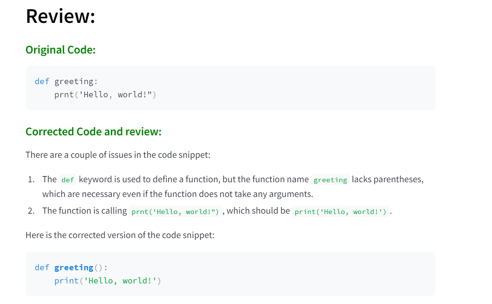

# GenAI App - AI Code Reviewer

## Description
The Python code reviewer GenAI App is a Python application powered by OpenAI's API, designed to help developers improve their Python code quality. Submit your Python code for review and receive instant feedback on potential bugs and suggested fixes. Built with Streamlit for an intuitive user experience.


## Objective

The objective of this project is to develop a Python application that allows users to submit their Python code for review and receive feedback on potential bugs along with suggestions for fixes. The application aims to be user-friendly, efficient, and provide accurate bug reports and fixed code snippets.





## User Interface

The application features a clean and intuitive user interface built using Streamlit. Users can easily input their Python code into the application through a text area.

## Code Review Functionality

The application utilizes the OpenAI API for code review functionality. It analyzes the submitted code and identifies potential bugs, errors, or areas of improvement. Additionally, it provides fixed code snippets to address the identified issues.

## Getting Started

### Prerequisites

Before running the application, ensure that you have Python installed on your system.


### Running the Application

To run the GenAI App - AI Code Reviewer:

```bash
streamlit run app.py
```

## Usage

1. Launch the application using the command provided above.
2. Input your Python code into the text area provided.
3. Click the "Get Review" button to receive feedback on your code.

## Contributing

Contributions are welcome! If you have suggestions for improvements or bug fixes, please open an issue or submit a pull request.

## License

This project is licensed under the [MIT License](LICENSE).

## Acknowledgments

- Thanks to OpenAI for providing the API used in this project.
- Streamlit for the user-friendly interface.

## Author
Snehal Vispute
